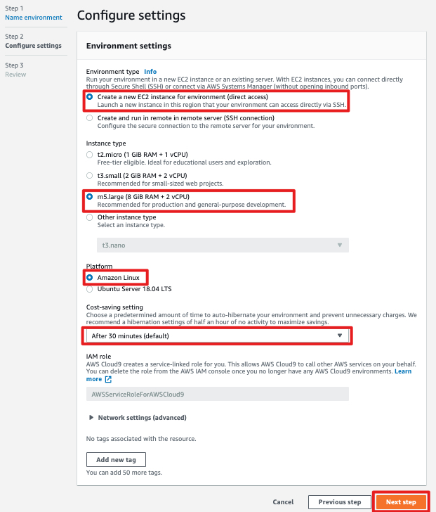
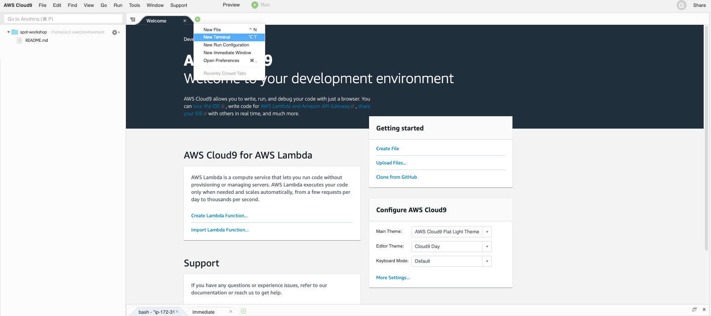
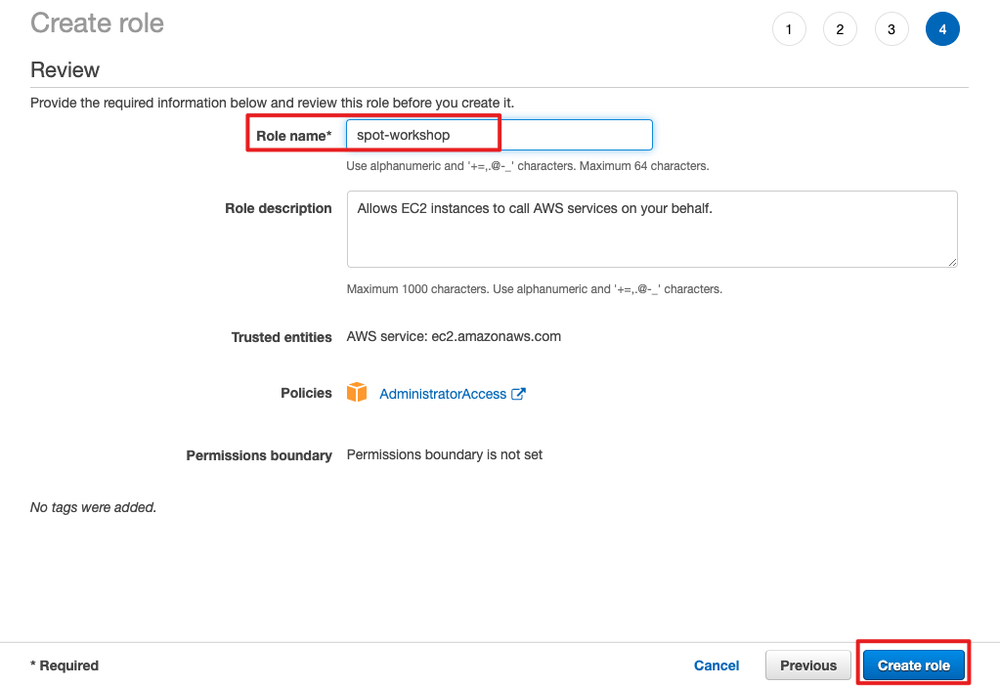
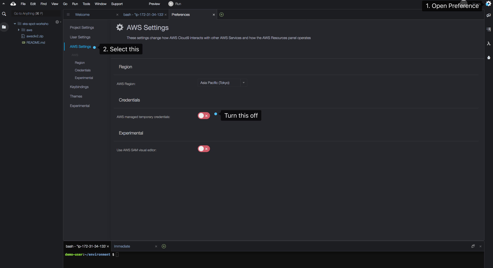

# 创建 Cloud9 环境

使用 AWS 用户登录: [https://us-west-2.console.aws.amazon.com/cloud9/home?region=us-west-2](https://us-west-2.console.aws.amazon.com/cloud9/home?region=us-west-2). 

**请将 AWS Region 切换成您的 Workshop 使用的区域。**

创建 Cloud9 环境, 步骤如下面截图所示:

[步骤-1]


[步骤-2]



[步骤-3]


创建完成后，会自动进入 Cloud9 IDE 环境：



如果退出 IDE 之后要再进入 Cloud9 环境，可以在 Cloud9 界面上点击 Open IDE 按钮：


# 安装所需工具和软件包


## 安装 JQ 和 envsubst

```
sudo yum -y install jq gettext
```

## 验证 jq, envsubst

```
for command in jq envsubst
  do
    which $command &>/dev/null && echo "$command in path" || echo "$command NOT FOUND"
  done
```

## 安装 AWS CLI

验证当前版本

```
aws --version
```

更新到最新版本

```
curl "https://awscli.amazonaws.com/awscli-exe-linux-x86_64.zip" -o "awscliv2.zip"
unzip awscliv2.zip
sudo ./aws/install
. ~/.bash_profile
```

确认最新版本安装成功

```
aws --version
```


# 创建 IAM Role


1.  在 AWS Console 选择 IAM 服务

2. 选择 AWS service --> EC2, 点击 "Next: Permissions"


3. 选择 "AdministratorAccess" 权限策略


4. 依次选择 “Next: Tags” 和 "Next: Review"

5. 命名角色名称, 比如 "fargate-workshop", 然后点击 "Create role"




# 添加 IAM Role 至 Cloud9 实例


1. 在 EC2 界面上找到您的 Cloud9 实例

2. 选择 Cloud9 对应的 EC2 实例, 然后选择: Actions --> Instance Settings --> Attach/Replace IAM Role


3. 选择上面创建的角色如 "fargate-workshop", 点击 Apply


4. 更新 Cloud9 默认的 IAM 权限模式




# 更新 Cloud9 环境


删除当前已经保留的 credentials 文件:

```
rm -vf ${HOME}/.aws/credentials
```

配置 AWS CLI 的当前的 region 信息:

```
export ACCOUNT_ID=$(aws sts get-caller-identity --output text --query Account)
export AWS_REGION=$(curl -s 169.254.169.254/latest/dynamic/instance-identity/document | jq -r '.region')

echo "export ACCOUNT_ID=${ACCOUNT_ID}" >> ~/.bash_profile
echo "export AWS_REGION=${AWS_REGION}" >> ~/.bash_profile

aws configure set default.region ${AWS_REGION}
aws configure get default.region
```

验证 Cloud9 已经使用最新的角色关联:

```
aws sts get-caller-identity
```


