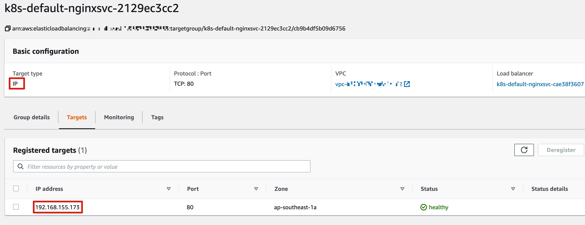
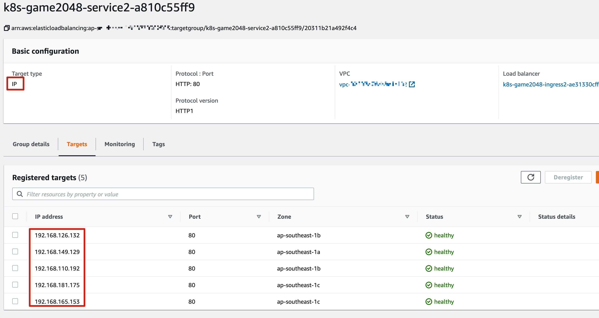

# 步骤4 - 部署应用到 Fargate


在 步骤 3 中，我们已经部署了 AWS Load Balancer Controller，在本节实验中，我们将实现 Kubernetes Service 和 Ingress 资源与 AWS NLB/ALB 的集成。

## Kubernetes Service 与 NLB IP 模式

我们创建一个简单的 Nginx Service，指定使用 nlb-ip 模式。首先创建 yaml 文件如下

```bash
cat << EOF > service-nlb-ip.yaml
apiVersion: v1
kind: Service
metadata:
  name: "nginx-svc-nlb-ip"
  annotations:
    service.beta.kubernetes.io/aws-load-balancer-type: nlb-ip
spec:
  selector:
    app: nginx
  type: LoadBalancer
  ports:
  - protocol: TCP
    port: 80
    targetPort: 80
---
apiVersion: apps/v1
kind: Deployment
metadata:
  labels:
    app: nginx
  name: nginx-deployment
spec:
  replicas: 1
  selector:
    matchLabels:
      app: nginx
  template:
    metadata:
      labels:
        app: nginx
    spec:
      containers:
      - image: nginx
        name: nginx
        ports:
        - containerPort: 80
EOF
```

部署 Service，该 Service 会部署到默认的 default namespace，根据 Fargate Profile 的定义，default namespace 中的 Pod 会调度到 Fargate 上。

```bash
kubectl apply -f service-nlb-ip.yaml
```


查看 Service 和 NLB 的创建情况，以及 Pod 是否以 IP 形式挂载

```bash
## 查看 nginx pod 创建情况
$ kubectl get po -o wide
NAME                               READY   STATUS    RESTARTS   AGE     IP                NODE                                                         NOMINATED NODE   READINESS GATES
nginx-deployment-d46f5678b-nplws   1/1     Running   0          2m32s   192.168.155.173   fargate-ip-192-168-155-173.ap-southeast-1.compute.internal   <none>           <none>

## 查看 nginx service 信息
$ kubectl describe service nginx-svc-nlb-ip
Name:                     nginx-svc-nlb-ip
Namespace:                default
Labels:                   <none>
Annotations:              service.beta.kubernetes.io/aws-load-balancer-type: nlb-ip
Selector:                 app=nginx
Type:                     LoadBalancer
IP:                       10.100.166.71
LoadBalancer Ingress:     k8s-default-nginxsvc-cae38f3607-6409a1bd5c8a9323.elb.ap-southeast-1.amazonaws.com
Port:                     <unset>  80/TCP
TargetPort:               80/TCP
NodePort:                 <unset>  30576/TCP
Endpoints:                192.168.155.173:80
Session Affinity:         None
External Traffic Policy:  Cluster
Events:
  Type    Reason                  Age    From                Message
  ----    ------                  ----   ----                -------
  Normal  EnsuringLoadBalancer    4m25s  service-controller  Ensuring load balancer
  Normal  SuccessfullyReconciled  4m22s  service             Successfully reconciled

## 访问 nginx service 对应的 NLB 地址
$ curl -I k8s-default-nginxsvc-cae38f3607-6409a1bd5c8a9323.elb.ap-southeast-1.amazonaws.com
HTTP/1.1 200 OK
Server: nginx/1.19.8
Date: Tue, 30 Mar 2021 16:44:33 GMT
Content-Type: text/html
Content-Length: 612
Last-Modified: Tue, 09 Mar 2021 15:27:51 GMT
Connection: keep-alive
ETag: "604793f7-264"
Accept-Ranges: bytes
```


在 AWS Console 上，查看 NLB 后面挂载的目标组，为 IP 模式；目标 IP 为 192.168.155.173，即上面 kubectl describe service 得到的 Endpoints 地址




## Kubernetes Ingress 与 ALB 集成

接下来我们创建一个 Kubernetes Ingress 资源

通过以下命令下载 2048 游戏 yaml 文件

```bash
curl -o 2048_full.yaml https://raw.githubusercontent.com/kubernetes-sigs/aws-load-balancer-controller/v2.1.0/docs/examples/2048/2048_full.yaml
```

该文件里创建了一个 game-2048 namespace，并在这个 namespace 里创建了 deployment-2048，service-2048 和 ingress-2048。 

其中 ingress 资源的配置如下，ingress.class 为 alb，将创建一个 internet-facing 的 IP 模式的 ALB。

有关更多的 基于 ALB 的 Ingress 的使用和配置，可参考 https://kubernetes-sigs.github.io/aws-load-balancer-controller/latest/guide/ingress/annotations/

```yaml
---
apiVersion: extensions/v1beta1
kind: Ingress
metadata:
  namespace: game-2048
  name: ingress-2048
  annotations:
    kubernetes.io/ingress.class: alb
    alb.ingress.kubernetes.io/scheme: internet-facing
    alb.ingress.kubernetes.io/target-type: ip
spec:
  rules:
    - http:
        paths:
          - path: /*
            backend:
              serviceName: service-2048
              servicePort: 80
```


我们先为  game-2048 namespace 创建 Fargate Profile，以便所有 Pod 能部署到 Fargate 上：

```bash
eksctl create fargateprofile --namespace game-2048 --cluster eks-fargate
```

输出示例如下：

```bash
2021-03-30 16:50:54 [ℹ]  eksctl version 0.42.0
2021-03-30 16:50:54 [ℹ]  using region ap-southeast-1
2021-03-30 16:50:55 [ℹ]  creating Fargate profile "fp-513d7361" on EKS cluster "eks-fargate"
2021-03-30 16:51:13 [ℹ]  created Fargate profile "fp-513d7361" on EKS cluster "eks-fargate"
```


Fargate Profile 创建成功后，部署 2048-game 的 yaml 文件

```bash
kubectl apply -f 2048_full.yaml 
```

查看 Ingress 资源状态

```bash
$ kubectl describe ing -n game-2048
Name:             ingress-2048
Namespace:        game-2048
Address:          k8s-game2048-ingress2-ae31330cff-484669734.ap-southeast-1.elb.amazonaws.com
Default backend:  default-http-backend:80 (<error: endpoints "default-http-backend" not found>)
Rules:
  Host        Path  Backends
  ----        ----  --------
  *           
              /*   service-2048:80 (<none>)
Annotations:  alb.ingress.kubernetes.io/scheme: internet-facing
              alb.ingress.kubernetes.io/target-type: ip
              kubernetes.io/ingress.class: alb
Events:
  Type    Reason                  Age   From     Message
  ----    ------                  ----  ----     -------
  Normal  SuccessfullyReconciled  4s    ingress  Successfully reconciled
```


查看 Pod 运行情况，可以看到 Pod 全部调度到了 Fargate 节点上

```bash
$ kubectl get po -n game-2048 -o wide
NAME                               READY   STATUS    RESTARTS   AGE    IP                NODE                                                         NOMINATED NODE   READINESS GATES
deployment-2048-64549f6964-6m79w   1/1     Running   0          2m5s   192.168.126.132   fargate-ip-192-168-126-132.ap-southeast-1.compute.internal   <none>           <none>
deployment-2048-64549f6964-j6jf5   1/1     Running   0          2m5s   192.168.181.175   fargate-ip-192-168-181-175.ap-southeast-1.compute.internal   <none>           <none>
deployment-2048-64549f6964-llbdt   1/1     Running   0          2m5s   192.168.110.192   fargate-ip-192-168-110-192.ap-southeast-1.compute.internal   <none>           <none>
deployment-2048-64549f6964-qz4rc   1/1     Running   0          2m5s   192.168.165.153   fargate-ip-192-168-165-153.ap-southeast-1.compute.internal   <none>           <none>
deployment-2048-64549f6964-x96km   1/1     Running   0          2m5s   192.168.149.129   fargate-ip-192-168-149-129.ap-southeast-1.compute.internal   <none>           <none>
```


在 AWS Console 上也可以查看 AWS Load Balancer Controller 创建的 ALB 和 目标组 信息，可以看到目标 Pod 以 IP 模式挂载到 ALB 后端，目标 IP 地址即是 service-2048 的 Backends Endpoint IP。




通过 Ingress 对应的 ALB 地址访问 service-2048，在浏览器打开 ALB URL：


