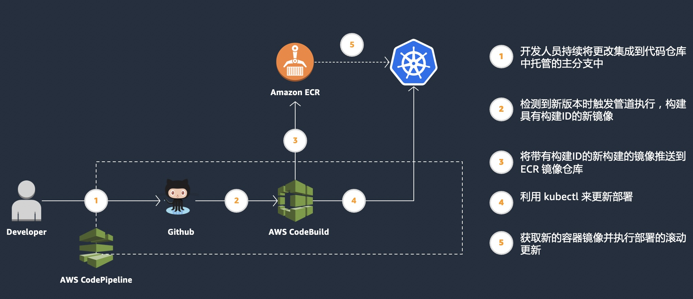

# 步骤 5 - 使用 Code 系列实现 CI/CD


使用 AWS Code 系列进行 CI/CD 的整体架构和流程如下图所示。

我们将使用 GitHub 作为代码仓库，因此本实验需要使用个人的 Github 账号。




## 为 CodeBuild 配置权限

首先，我们需要为 CodeBuild 创建一个 IAM role 使其能有访问 EKS 集群的权限，同时需要将该权限通过 aws-auth ConfigMap 映射到 EKS 的 RBAC 权限中，以便部署阶段在 CodeBuild 中通过 kubectl 部署服务新版本到 EKS 集群中。

创建 IAM role 并赋予权限：

```bash
## 获取当前账号ID
ACCOUNT_ID=$(aws sts get-caller-identity | jq -r '.Account')

## 创建 IAM role
TRUST="{ \"Version\": \"2012-10-17\", \"Statement\": [ { \"Effect\": \"Allow\", \"Principal\": { \"AWS\": \"arn:aws:iam::${ACCOUNT_ID}:root\" }, \"Action\": \"sts:AssumeRole\" } ] }"
aws iam create-role --role-name EKSCodeBuildKubectlRole --assume-role-policy-document "$TRUST" --output text --query 'Role.Arn'

## 赋予 IAM role 权限
echo '{ "Version": "2012-10-17", "Statement": [ { "Effect": "Allow", "Action": "eks:Describe*", "Resource": "*" } ] }' > /tmp/iam-role-policy
aws iam put-role-policy --role-name EKSCodeBuildKubectlRole --policy-name eks-describe --policy-document file:///tmp/iam-role-policy
```


更新 aws-auth ConfigMap，添加刚才创建的 IAM role：

```bash
ROLE="    - rolearn: arn:aws:iam::${ACCOUNT_ID}:role/EKSCodeBuildKubectlRole\n      username: build\n      groups:\n        - system:masters"

kubectl get -n kube-system configmap/aws-auth -o yaml | awk "/mapRoles: \|/{print;print \"$ROLE\";next}1" > /tmp/aws-auth-patch.yml

kubectl patch configmap/aws-auth -n kube-system --patch "$(cat /tmp/aws-auth-patch.yml)"
```


更新完成后，查看 ConfigMap 种新添加的 mapRole 字段，示例如下：

```bash
$ kubectl describe cm aws-auth -n kube-system
Name:         aws-auth
Namespace:    kube-system
Labels:       <none>
Annotations:  <none>

Data
====
mapRoles:
----
- rolearn: arn:aws:iam::<ACCOUNT_ID>:role/EKSCodeBuildKubectlRole
  username: build
  groups:
    - system:masters
...
...
```


## Fork 示例代码仓库

登录 GitHub，并 fork 如下代码仓库。后续实验中该代码仓库会作为 CodeBuild 的触发源。

https://github.com/guoxun19/eks-cicd-sample-app

代码仓库中包括四个文件，分别是：

- 应用的 Dockerfile：基于 amazonlinux2 安装了一个 httpd 服务，并将仓库中的 index.html 拷贝到 /var/www/html/index.html
- Index.html：httpd 服务的内容页，后续会通过修改该 html 内容来模拟和观察代码修改后 CICD 的情况
- buildspec.yml：[CodeBuild](https://docs.aws.amazon.com/codebuild/latest/userguide/welcome.html) 的配置文件
- hello-fargate.yaml：用于创建 Deployment 和 Servcie，其中 Deployment 里的 Pod 会使用 CodeBuild 基于 Dockerfile 构建的 docker image，Service 为 LoadBalancer 类型


## 创建 GitHub Access Token

登录 GitHub 后，在 Settings -> Developer settings 中，创建一个新的 Personal access token。填写 token 名称，勾选 repo 后，点击 Generate token，如下图：


Token 创建成功后，一定要记录和保存 Token 内容，后面会用到。


## 创建和配置 CodePipeline

为了实验方便，我们提供了一个 [CloudFormation]() 模板用于创建和配置 CodePipeline。模板文件位于本实验 cf-template 目录下 ci-cd-codepipeline.cfn.yml，请下载该文件。

打开 AWS 控制台 CloudFormation 界面，点击 Create Stack。

在 template 界面上，选择 Upload a template file，然后选择刚才下载的 ci-cd-codepipeline.cfn.yml 模板文件，点击下一步。


在模板参数界面上：填写 Stack 名称，你的 GitHub 用户名/Access Token（在上一步创建的），以及将 EKS cluster name 改成你自己的 EKS 集群名称。点击下一步


后面的内容都保持默认， 在最后 Review 页面上，勾选 **I acknowledge that AWS CloudFormation might create IAM resources.** 后点击 Create Stack。


## 查看 CodePipeline 执行情况

CloudFormation 创建完成后，切换到 Codepipeline 界面，可以看到正在执行第一次的 CI/CD


点击 Details 可切换到 CodeBuild 界面，查看构建过程的输出日志。CodeBuild 会按照 GitHub 仓库中 buildspec.yml 来执行构建。


CodeBuild 执行成功后，我们可以查看 Service 和 Pod 是否成功部署。

```bash
$ kubectl get pod -l app=hello-fargate
NAME                             READY   STATUS    RESTARTS   AGE
hello-fargate-77c6d598ff-gcv27   1/1     Running   0          2m29s
hello-fargate-77c6d598ff-r5js2   1/1     Running   0          2m29s
hello-fargate-77c6d598ff-r8blf   1/1     Running   0          2m29s

$ kubectl get svc hello-fargate
NAME            TYPE           CLUSTER-IP      EXTERNAL-IP                                                                    PORT(S)        AGE
hello-fargate   LoadBalancer   172.16.138.67   k8s-default-hellofar-e5b2caf5a2-2f4b4eb73ab7de42.elb.us-east-1.amazonaws.com   80:30903/TCP   3m33s
```


需要等待几分钟让 ELB 部署完成并且注册上去的 Pod 通过健康检查，可以在 EC2 界面查看。

 打开浏览器访问 Service，可以看到 index.html 中的内容为我们在代码仓库中所定义的。


## 修改代码仓库文件，触发新构建和部署

在 GitHub 中直接修改 index.html 文件，将内容改为 **This is code version #2** 后提交 Commit。

再次进入 Codepipeline 页面，可以看到新的构建被触发。同样，点击 Details 可以跳转到 CodeBuild 查看详细日志信息。


刷新浏览器页面可以看到页面内容已经更新。


